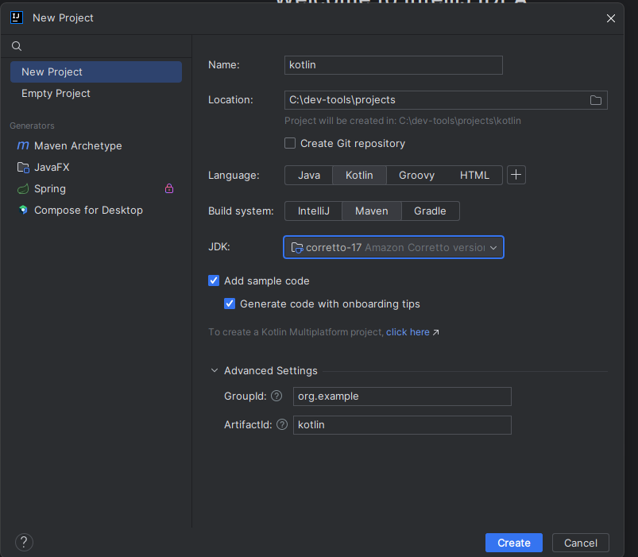

# Curso Kotlin + Java17 + Maven

````
Linguagem multiplataforma, orientada a objetos, criada pela JetBrains em 2011

Backend mock:
https://www.cheapshark.com/api/1.0/games?id=146

Maneiras de consumir uma API externa:
Retrofit, OkHttp ou HTTP Client (Utilizada nos exemplos)

Maneiras de desserialização dos dados:
kotlinx.serialization, Jackson ou Gson (Utilizada nos exemplos)
````

                                         <br>

## Data Classes

As Data Classes no Kotlin são muito utilizadas quando queremos declarar classes com o objetivo principal de armazenar
dados. <br>
https://kotlinlang.org/docs/data-classes.html               <br>

````
// To string vem pronto, faz o parse automatico, sem previsar do SerializedName
data class br.com.alura.alugames.modelo.InfoApiShark(
    val title: String,
    val thumb: String
)
````

## Scope functions

https://kotlinlang.org/docs/scope-functions.html            <br>

````
Faz o update nas variaveis do gamer1
let      - Executa uma ação em um objeto e retorna o resultado da expressão lambda;
run      - Também executa uma ação em um objeto como o let, mas não retorna o resultado da expressão, e sim o resultado do bloco de código;
with     - Executa uma sequência de operações sendo necessário passar o objeto como argumento explícito;
apply    - Realiza operações de configuração em um objeto e retorna o próprio objeto modificado;
also     - Realiza a mesma coisa que o apply, porém retorna o próprio objeto original.
gamer1.let {
    it.dataNascimento = "28/10/1988"
    it.usuario = "gustaveraxd"
    it.idInterno = "gustaveraxd123"
}
````

## Estension functions

https://kotlinlang.org/docs/extensions.html#extension-functions <br>

````
Sobrescreve o String para o projeto
fun String.transformarEmIdade(): Int {
val formatter = DateTimeFormatter.ofPattern("dd/MM/yyyy")

    val dataNascimento = LocalDate.parse(this, formatter)
    val hoje = LocalDate.now()
    val idade = Period.between(dataNascimento, hoje).years

    return idade
}
````